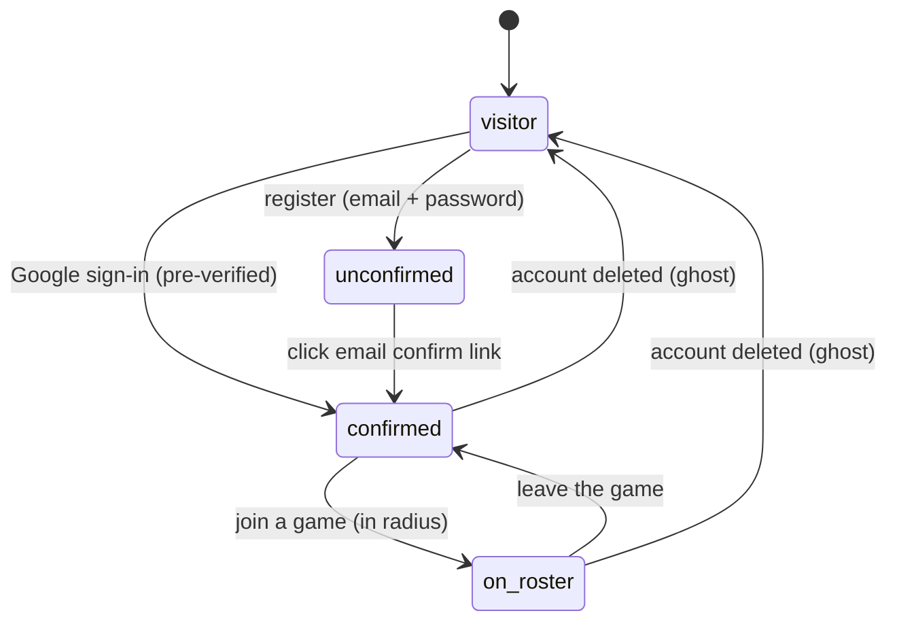
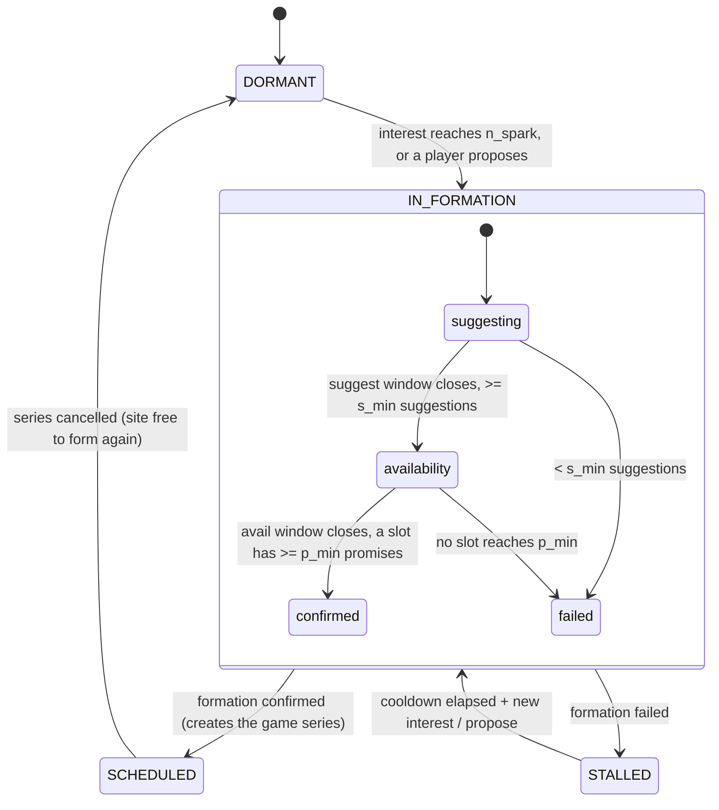
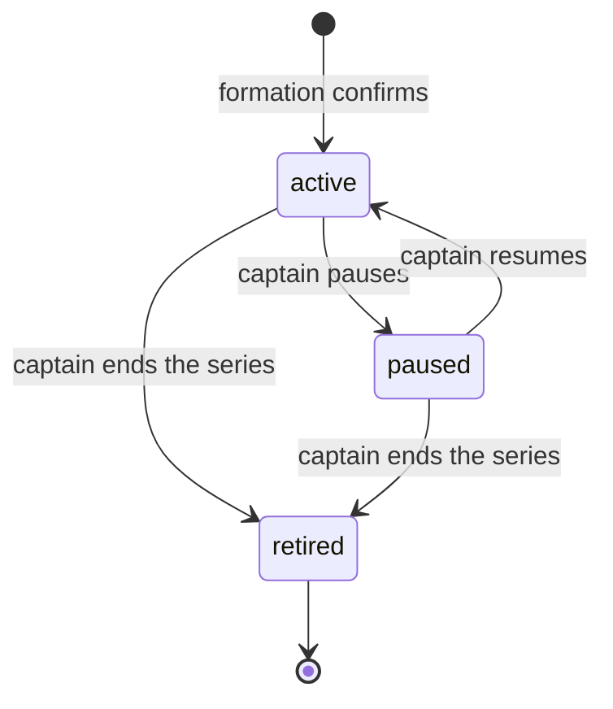
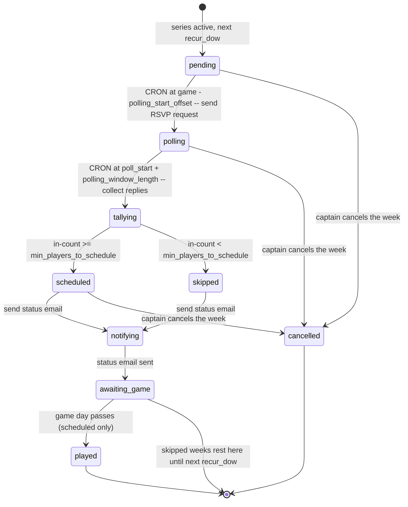

# State machines

Three things in the app have a lifecycle: a **user**, a **game site** (an area
where games can form and live), and a **weekly game**. The weekly game has two
tiers — the **series** a captain runs, and each week's **occurrence**.

Each transition below is tagged:

- **built** — the code drives it today
- **to-build** — part of the target model, not implemented yet

Source of truth for the engine transitions: `lib/mime/engine.ts`, `lib/mime/fsm.ts`,
`lib/mime/occurrences.ts`, `lib/mime/freeze.ts`; auth/gating in `lib/auth*`,
`lib/auth/verified.ts`.

> Status note: the series and occurrence machines below are now **implemented**
> (migrations 015–017, the occurrence engine, captain controls, and the
> POLL_ASK / WEEK_ON / WEEK_OFF emails). The "to-build" tags in the tables are
> historical — kept to show what each phase added.

---

## 1. User

| From | To | Trigger / condition | Status |
|---|---|---|---|
| visitor | unconfirmed | register with email + password; confirm email sent | built |
| visitor | confirmed | Google sign-in (Google pre-verifies the address) | built |
| unconfirmed | confirmed | click the confirm link (or resend then click) | built |
| confirmed | on_roster | join a game — gated on confirmed email + travel radius | built |
| on_roster | confirmed | leave the game (no more rosters) | built |
| any signed-in | visitor | account row deleted → session callback drops the user | built |

Notes:
- An **interest signal** is created when the user sets a location (the
  show-interest form does account + interest in one step). It's a property of the
  account, not a separate auth state, so it isn't drawn as its own node.
- `unconfirmed` can browse the map but cannot join or propose
  (`isEmailVerified` gate in the join/propose actions).

---

## 2. Game site (area)

`PRIMED` was pruned — `DORMANT` already covers "no formation running". The
formation-attempt pipeline runs **inside** `IN_FORMATION` and is shown as nested
sub-states.

| From | To | Trigger / condition | Status |
|---|---|---|---|
| DORMANT | IN_FORMATION | active interest ≥ `n_spark`, or a player proposes a spot | built |
| IN_FORMATION | SCHEDULED | formation attempt CONFIRMED → spawns a game series (STAGED) | built |
| IN_FORMATION | STALLED | attempt FAILED (< `s_min` suggestions, or no slot ≥ `p_min`) | built |
| STALLED | IN_FORMATION | cooldown elapsed (backoff 14/30/60 days) + new interest / propose | built |
| SCHEDULED | DORMANT | the site's game series is cancelled | to-build |

Formation-attempt sub-states (the `attempt_status` enum). `COMPILING` and
`ADJUDICATING` are transient "claimed by the tick" states between the windows;
`CANCELLED` is unused and pruned.

| From | To | Trigger / condition | Status |
|---|---|---|---|
| SUGGESTING | AVAILABILITY | suggest window closes with ≥ `s_min` suggestions (options compiled, capped at `options_cap`) | built |
| SUGGESTING | FAILED | suggest window closes with < `s_min` suggestions | built |
| AVAILABILITY | CONFIRMED | avail window closes, top slot has ≥ `p_min` promises | built |
| AVAILABILITY | FAILED | avail window closes, no slot reaches `p_min` | built |

### Site config (new — drives the weekly occurrence cycle)

Each game site carries the knobs the per-week poll runs on. All to-build.

| Field | Default | Meaning |
|---|---|---|
| `min_players_to_schedule` | 6 | RSVP'd "in" needed at poll close to schedule the game (else skip) |
| `polling_window_length` | 24h | how long the RSVP poll stays open |
| `polling_start_offset` | 48h before game | when the poll opens (and the request email goes out) |

So with the defaults: poll opens 48h before kickoff, runs 24h, and closes 24h
before kickoff — at which point the headcount is compared to `min_players_to_schedule`.

---

## 3. Weekly game — series

The standing game a captain runs. It never "completes" — it recurs until the
captain ends it, which **retires** it. (`game_status` had
`STAGED/STANDING/COMPLETED/CANCELLED`; only `STAGED` was ever written. Target:
collapse `STAGED`+`STANDING` into `active`, drop `COMPLETED`, add `paused`, and
the terminal state is `retired`.)

| From | To | Trigger / condition | Status |
|---|---|---|---|
| (formation) | active | a formation attempt confirms a winning slot | built (as `STAGED`) |
| active | paused | captain pauses the series (off-season, injury, etc.) | to-build |
| paused | active | captain resumes | to-build |
| active / paused | retired | captain ends the series (frees the site) | to-build |

---

## 4. Weekly game — occurrence

Each week the active series produces one occurrence (the game on a given date).
This is the real per-week lifecycle, fully unpacked — no hidden steps. An
internal cron drives the time-based transitions; the thresholds come from
per-site config (see below).

| From | To | Trigger | Status |
|---|---|---|---|
| (series active) | pending | the next `recur_dow` date exists; nothing sent yet | to-build |
| pending | polling | **cron** fires at `game_time − polling_start_offset` → send the RSVP request email | to-build |
| polling | tallying | **cron** fires at `poll_start + polling_window_length` → collect the replies | to-build |
| tallying | scheduled | "in" count ≥ `min_players_to_schedule` | to-build |
| tallying | skipped | "in" count < `min_players_to_schedule` | to-build |
| scheduled / skipped | notifying | send the status email (both outcomes) | to-build |
| notifying | awaiting_game | the status email has been sent | to-build |
| awaiting_game | played | game day passes (scheduled occurrences only) | partial (freeze backfills attendance) |
| pending / polling / scheduled | cancelled | captain cancels that specific week | to-build |

The **status email** (sent in both the scheduled and skipped cases) tells every
roster member:
- the game status for the week (on, or skipped),
- their own RSVP choice, and
- a one-click link to change it for this game:
  - **"play after all"** if they'd marked not interested, or
  - **"bail"** if they'd said they were in but can't make it (with a nudge to let
    the other players know).

These links stay live during `awaiting_game` (between the status email and
kickoff). Entering `awaiting_game` only happens *after* the status email is sent.

Notes:
- The poll reuses the formation attempt's nudge / last-call rhythm
  (`AVAIL_NUDGE`, `AVAIL_LASTCALL`, `GAME_ON` in `notification_kind`), just for an
  already-scheduled slot.
- Occurrences are **computed** today (from `recur_dow`/`recur_time` +
  `game_attendance`), not stored. The poll/tally/notify steps each need durable
  state ("polling", "scheduled but not yet notified", etc. have no date-derived
  signal), so this tier wants a persisted row per occurrence.

---

## Enum cleanup implied by this model

- `area_status`: drop `PRIMED`.
- `attempt_status`: drop `CANCELLED` (unused).
- `game_status`: this enum is doing two jobs. Split it —
  - a **series** status: `active` / `paused` / `retired`
  - an **occurrence** status: `pending` / `polling` / `tallying` / `scheduled` /
    `skipped` / `notifying` / `awaiting_game` / `played` / `cancelled`
    (`tallying` and `notifying` are transient cron steps, like the formation's
    `COMPILING`/`ADJUDICATING`).

  `STAGED`/`STANDING`/`COMPLETED`/`CANCELLED` go away.
- New per-site config columns: `min_players_to_schedule`, `polling_window_length`,
  `polling_start_offset` (see the game-site section).
